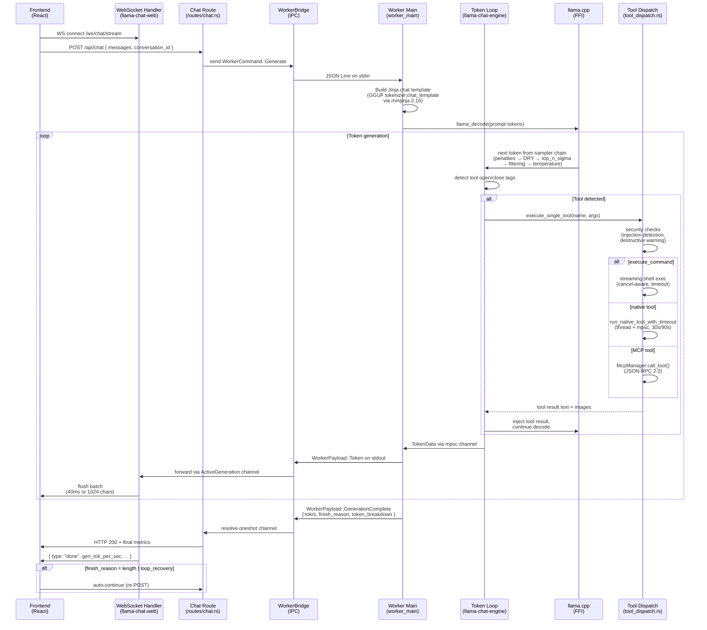
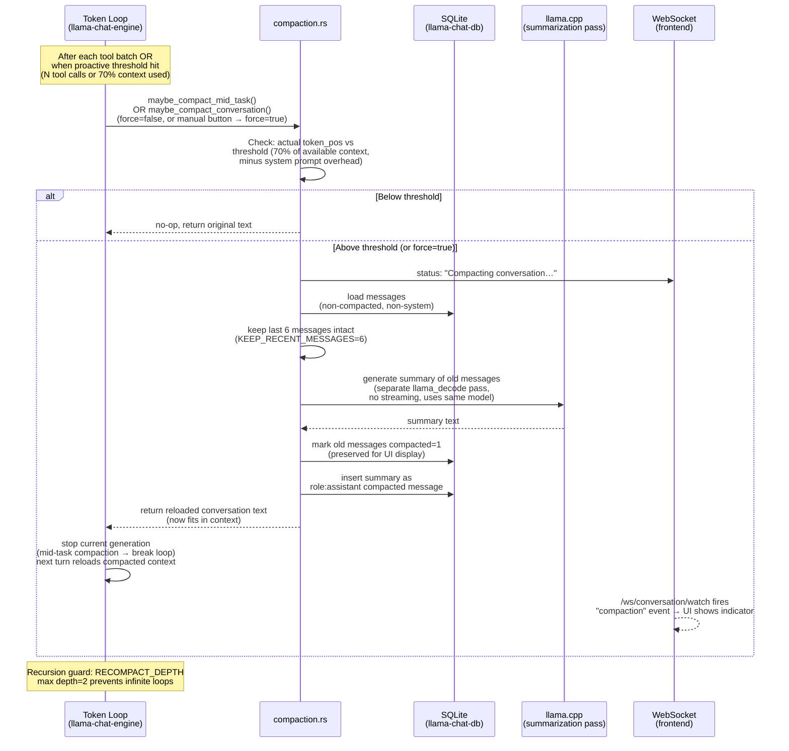
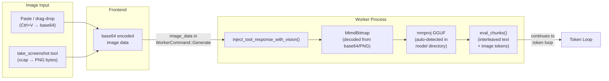

# App Architecture

## 1. Process Model

```mermaid
graph TB
    subgraph OS["Operating System"]
        subgraph TauriProc["Server Process (main)"]
            direction TB
            Tauri["Tauri Runtime\n(WebView2 host)"]
            AxumHTTP["Axum HTTP Server\n:18080"]
            WorkerBridge["WorkerBridge\nArc&lt;WorkerBridge&gt;"]
            DB["SQLite Database\n(llama-chat-db)"]
            MCP_UI["MCP UI Server\n(WebView2 ExecuteScript\nvia raw COM vtable)"]
            McpManager["MCP Manager\n(external servers via\nstdio/HTTP/SSE)"]

            Tauri --> AxumHTTP
            Tauri --> MCP_UI
            AxumHTTP --> WorkerBridge
            AxumHTTP --> DB
            AxumHTTP --> McpManager
        end

        subgraph WorkerProc["Worker Process (child, --worker flag)"]
            direction TB
            WorkerMain["Worker Main\n(own tokio runtime)"]
            LlamaEngine["llama-chat-engine\n(token_loop, tool_dispatch,\nsampler chain)"]
            LlamaCpp["llama-cpp-rs\n(llama.cpp FFI)"]
            KVCache["InferenceCache\n(LlamaContext reuse\nbetween turns)"]

            WorkerMain --> LlamaEngine
            LlamaEngine --> LlamaCpp
            LlamaEngine --> KVCache
        end

        subgraph Frontend["Frontend (WebView2)"]
            React["React + TypeScript\n(Vite, port 14000)"]
        end
    end

    WorkerBridge -->|"JSON Lines\nstdin → WorkerCommand"| WorkerMain
    WorkerMain -->|"JSON Lines\nstdout → WorkerPayload"| WorkerBridge
    React -->|"HTTP REST + WebSocket"| AxumHTTP
    Tauri -->|"renders"| Frontend

    style TauriProc fill:#1a3a5c,stroke:#4a8cc7
    style WorkerProc fill:#1a4a2a,stroke:#4ac74a
    style Frontend fill:#4a2a1a,stroke:#c78a4a
```



---

## 2. Token Generation Pipeline



---

## 2b. Conversation Title Generation (background, after each turn)

After each generation completes, the app automatically generates or updates the conversation title using the same loaded model in an isolated context. This runs in the background and never blocks the main conversation.

```mermaid
sequenceDiagram
    participant Chat as Chat Route<br/>(routes/chat.rs)
    participant Title as title.rs<br/>(spawn_title_generation)
    participant WB as WorkerBridge<br/>(IPC)
    participant WM as Worker / sub_checks.rs<br/>(generate_title_text)
    participant DB as SQLite

    Note over Chat: Generation complete<br/>(local model OR OpenAI-compat provider)

    Chat->>Title: spawn_title_generation()<br/>tokio::spawn (non-blocking)

    Title->>Title: wait 500ms

    Title->>DB: fetch_messages(conv_id)
    DB-->>Title: all messages

    Title->>Title: extract first user + first assistant<br/>(first 200 chars each, tool tags stripped)<br/>+ last exchange if conversation is longer

    Title->>WB: bridge.generate_title(prompt)<br/>WorkerCommand::GenerateTitle { conv_id, prompt }
    WB->>WM: JSON Line on stdin

    WM->>WM: create_fresh_context(2048 tokens)<br/>apply chat template (Jinja or fallback)<br/>System: "Generate a concise title (3-6 words).<br/>Respond with ONLY the title."<br/>tokenize + llama_decode

    WM->>WM: sample up to 30 tokens<br/>(temp=0.7, dist sampler)<br/>stop at EOS or newline<br/>drop context immediately (no cache pollution)

    WM->>WB: WorkerPayload::TitleGenerated { conv_id, title }
    WB-->>Title: title string

    Title->>Title: sanitize_title()<br/>strip "Title:" prefix, quotes, markdown<br/>take first line, truncate to 60 chars<br/>reject if starts with '<' (hallucinated HTML)

    Title->>DB: update_conversation_title(conv_id, title)<br/>UPDATE conversations SET title = ?

    Note over Title: Frontend receives update<br/>via /ws/conversation/watch
```

> **OpenAI-compat providers**: instead of the local model, `generate_title_via_provider()` makes an HTTP POST to the provider's `/chat/completions` with max_tokens=20. Same prompt shape, same sanitization, same DB write.
>
> **Context isolation**: the 2048-token fresh context is dropped immediately after title generation. The main conversation's `InferenceCache` (KV cache) is completely untouched.

---

## 2c. Compaction Flow (part of the pipeline)



---

## 3. Cargo Workspace Crates

```mermaid
graph BT
    subgraph Leaf["Foundational (no app deps)"]
        Types["llama-chat-types\nShared types: IPC messages,\nNativeToolResult, ToolTags,\nChatMessage, WorkerCommand/Payload"]
        DB["llama-chat-db\nSQLite schema, conversations,\nmessage history, event log,\ndownload tracking"]
        Config["llama-chat-config\nConfig load/save,\nsystem prompt templates,\ntag pair management"]
        Command["llama-chat-command\nShell exec (streaming + background),\nANSI strip, PID cleanup,\noutput truncation"]
    end

    subgraph Mid["Mid-layer"]
        Tools["llama-chat-tools\nNative tool dispatch\n(browser, file, exec, read-only),\nMCP tool registry,\nJSON schema handling"]
        Desktop["llama-chat-desktop-tools\nOCR (WinRT), UI automation\n(YOLO+ort), screenshot\nvia WebView2 CDP"]
        Engine["llama-chat-engine\nToken loop, tool dispatch,\nsampler config, sub-agents,\nchat template rendering,\ncompaction, vision/MTMD"]
    end

    subgraph Top["App Layer"]
        Web["llama-chat-web\nAxum HTTP router,\nWebSocket handlers,\nWorkerBridge, WorkerPool,\nprocess manager"]
        Worker["llama-chat-worker\nWorker process entry,\nmodel load/unload,\nIPC command handling,\nMCP client, crash recovery"]
    end

    Types --> Tools
    Types --> Engine
    Types --> Web
    Types --> Worker
    DB --> Web
    DB --> Worker
    DB --> Engine
    Config --> Web
    Config --> Worker
    Config --> Engine
    Command --> Tools
    Command --> Engine
    Tools --> Engine
    Tools --> Worker
    Desktop --> Worker
    Engine --> Worker
    Web --> Worker

    style Leaf fill:#1a2a3a,stroke:#4a6a8a
    style Mid fill:#1a3a2a,stroke:#4a8a6a
    style Top fill:#3a2a1a,stroke:#8a6a4a
```



---

## 3b. Tool Output Processing Pipeline

Tool results flow through two distinct processing stages. Stage 1 differs between single-tool and batch calls. Stage 2 is always the same shared outer pass.

> **RTK note**: the model can write `rtk git diff` in a tool call — the app just **strips the `rtk ` prefix** and runs the command directly. RTK binary never executes inside the app.

### Stage 1A — Single tool execution (`single_exec.rs`)

```mermaid
flowchart TD
    Detect["Single tool call detected\n(parse → security check → loop check)"]

    SpawnAgent["spawn_agent\n→ run_sub_agent()\n(full recursive agent call,\nown token loop + tools)"]

    ExecCmd["execute_command\n→ streaming shell exec\n(ANSI-strip per line,\ncancel-aware, timeout)"]

    NativeTool["native / browser / MCP tool\n→ run_native_tool_with_timeout()\n(thread + 30s/90s timeout)"]

    QCheck["quick_tool_result_check()\nLightweight LLM pass (first 500 chars)\n→ prepends [TOOL_RESULT:success]\nor [TOOL_RESULT:error]\n(stripped later; UI displays status icon)"]

    Fallback["fallback: execute_command_streaming\n(unrecognized JSON-like → error msg)"]

    Images["Images collected:\n(native_result.images)"]

    Detect --> SpawnAgent
    Detect --> ExecCmd
    Detect --> NativeTool
    NativeTool --> QCheck --> Images
    Detect --> Fallback
    ExecCmd --> Images
    SpawnAgent --> Images

    style QCheck fill:#1a3a1a,stroke:#4ac74a
    style SpawnAgent fill:#3a1a3a,stroke:#c74ac7
```



### Stage 1B — Batch tool execution (`batch_exec.rs`, N > 1 tools)

```mermaid
flowchart TD
    BatchDetect["Batch tool calls detected\n(all_calls: [(name, args)])"]

    Group["Group by read/write classification\n(or force_parallel for ‹parallel_calls› fence)"]

    ParallelGroup["Read-only tools\n→ std::thread::scope parallel\n(up to MAX_PARALLEL_TOOLS=10)\nrun_native_tool_with_timeout()"]

    SerialGroup["Write/mutating tools\n→ serial loop\nexecute_single_tool()"]

    PerToolSummarize["Per-tool: maybe_summarize_or_truncate()\n(reads summary arg from tool call args)"]

    SumFalse["summary=false\n→ maybe_truncate_tool_output()\n8000 char head 75% + tail 25%"]

    LLMSum["maybe_summarize_tool_output()\nPass-through if ≤ 8000 chars\nExempt: read_file, write_file, edit_file,\nbrowser_get_html, browser_eval → truncate\nSingle pass if ≤ 10 000 chars\n(8K ctx, 512 tokens, tool-specific prompt)\nMap-reduce if > 10 000 chars\n(4K ctx reused, 10K chunks, recursive reduce)"]

    Header["Prepend [Tool N: name] header\nStream each result to frontend"]

    Combined["Combined output string\n(in original call order)"]

    BatchDetect --> Group
    Group -->|read-only| ParallelGroup
    Group -->|mutating| SerialGroup
    ParallelGroup --> PerToolSummarize
    SerialGroup --> PerToolSummarize
    PerToolSummarize -->|"summary=false"| SumFalse
    PerToolSummarize -->|"default"| LLMSum
    SumFalse --> Header
    LLMSum --> Header
    Header --> Combined

    style LLMSum fill:#1a3a1a,stroke:#4ac74a
    style SumFalse fill:#3a2a1a,stroke:#c78a4a
    style ParallelGroup fill:#1a2a3a,stroke:#4a6ac7
```



### Stage 2 — Shared outer pass (`output_assembly.rs`, runs for BOTH single and batch)

```mermaid
flowchart TD
    Input["Raw combined output\n(from Stage 1A or 1B)"]

    Strip["1. Strip [TOOL_RESULT:success/error] prefix\n(frontend-only tag, not for model)"]

    Sanitize["2. sanitize_command_output()\nbasic control char cleanup"]

    Truncate["3. maybe_truncate_tool_output()\n8000 char hard cap\nhead 75% + tail 25% + one-liner notice"]

    SumArg{"4. summary arg\nin original tool call?"}

    SumDisabled["summary=false\nor read_file/write_file/edit_file\n→ pass through exact"]

    Threshold{"5. output > 4000 chars?\n(SUMMARIZE_THRESHOLD)"}

    LLMPass["summarize_tool_output()\nSimple single pass\nFresh 8K ctx, 512 tokens, temp=0.3\nGeneric prompt: 'keep errors/paths/status'\nor custom prompt if supplied"]

    SumFail["summarization error\n→ fall back to sanitized"]

    ResultPair["Result pair\ndisplay = sanitized + 📝 summary block\nmodel_text = [SUMMARIZED: N→M chars.\\nUse summary=false to get raw output.]\\nsummary"]

    Assemble["assemble_output()\nwrap in output open/close tags\nappend HTTP error hint if any\nprepend fuzzy parse warning if any"]

    Template["wrap_output_for_model()\nChat template turn injection:\nChatML / Llama3 / Gemma / GLM / Harmony / LFM2"]

    Tokenize["model.str_to_token() → kv inject"]

    Images{"Images from tool?"}

    VisionSum["run_image_vision_summary()\nFresh 4096 ctx, 400 tokens, temp=0.2\n<__media__> marker per image\neval_chunks() through mmproj\n→ inject text description instead of raw images"]

    RawVision["Inject raw images\ndirectly into vision pipeline\n(summary=false)"]

    Input --> Strip --> Sanitize --> Truncate --> SumArg
    SumArg -->|"summary=false or exempt tool"| SumDisabled --> Assemble
    SumArg -->|"absent or custom prompt"| Threshold
    Threshold -->|"≤ 4000 chars"| Assemble
    Threshold -->|"> 4000 chars"| LLMPass
    LLMPass -->|ok| ResultPair --> Assemble
    LLMPass -->|error| SumFail --> Assemble
    Assemble --> Template --> Tokenize
    Tokenize --> Images
    Images -->|"yes, summary≠false"| VisionSum
    Images -->|"yes, summary=false"| RawVision
    Images -->|no| Done["continue token loop"]
    VisionSum --> Done
    RawVision --> Done

    style LLMPass fill:#1a3a1a,stroke:#4ac74a
    style VisionSum fill:#1a2a3a,stroke:#4a6ac7
    style Template fill:#2a2a1a,stroke:#8a8a4a
```



> **Important thresholds**: Stage 1B per-tool summarization triggers at **8000 chars**. Stage 2 outer summarization triggers at **4000 chars**. Large batch outputs can therefore go through two LLM summary passes — one per-tool in Stage 1B, then again on the combined output in Stage 2 if it remains above 4000 chars.

---

## 4. Tool Dispatch Flow

```mermaid
flowchart TD
    TL["Token Loop\n(detects tool tags)"]
    Parse["Parse tool call\n(JSON → Mistral comma\n→ Llama3 XML → GLM XML)"]
    Security["Security checks\n(injection detection,\ndestructive warning)"]
    Route{"Tool type?"}

    ExecCmd["execute_command\n(streaming shell)"]
    SpawnAgent["spawn_agent\n(recursive sub-agent\nwith fresh context)"]
    Native["Native tools\n(thread + 30s timeout)"]
    Browser["Browser tools\n(thread + 90s timeout)"]
    MCP["MCP tools\n(JSON-RPC 2.0 over\nstdio/HTTP/SSE)"]
    Desktop["Desktop tools\n(enigo: click/type/key,\nscreenshot)"]

    ReadOnly{"Read-only?"}
    Serial["Serial execution\n(one at a time)"]
    Parallel["Parallel execution\n(up to 10 concurrent)"]

    Result["Tool result\n(text + optional images)"]
    Inject["Inject into conversation\n(role:tool message)"]
    Continue["Continue token generation"]

    TL --> Parse --> Security --> Route

    Route -->|"execute_command"| ExecCmd
    Route -->|"spawn_agent"| SpawnAgent
    Route -->|"read_file / search_files\ngit_diff / browser_get_text\ncheck_background_process ..."| ReadOnly
    Route -->|"browser_navigate\nbrowser_click ..."| Browser
    Route -->|"mcp__*__*"| MCP
    Route -->|"click_screen / type_text\ntake_screenshot ..."| Desktop

    ReadOnly -->|yes| Parallel
    ReadOnly -->|no| Serial

    ExecCmd --> Result
    SpawnAgent --> Result
    Parallel --> Native --> Result
    Serial --> Native --> Result
    Browser --> Result
    MCP --> Result
    Desktop --> Result

    Result --> Inject --> Continue

    style Parallel fill:#1a3a1a,stroke:#4ac74a
    style Serial fill:#3a1a1a,stroke:#c74a4a
    style Security fill:#3a2a1a,stroke:#c7a44a
```



---

## 5. WebSocket & Streaming Architecture

```mermaid
graph LR
    subgraph FE["Frontend"]
        ChatCtx["ChatContext\n(token append,\nauto-continue)"]
        ConnCtx["ConnectionContext\n(WS state machine:\nconnecting → connected\n→ error → reconnect)"]
        ModelCtx["ModelContext\n(load status,\nVRAM bar)"]
        AgentCtx["AgentContext\n(active agent,\nmodel config)"]
    end

    subgraph WS["WebSocket Endpoints"]
        WSChat["/ws/chat/stream\ntoken streaming\n(batched: 40ms / 1024 chars)"]
        WSConv["/ws/conversation/watch/:id\nevent log (tool calls,\ncompaction, stalls)"]
        WSStatus["/ws/status\nmodel load %,\nVRAM usage,\nprocess stats"]
    end

    subgraph Bridge["WorkerBridge / Pool"]
        Pool["WorkerPool\n(default + per-agent workers)"]
        Bridge2["WorkerBridge\n(pending map:\nid → oneshot)"]
        StdoutReader["stdout reader task\n(JSON Lines deserialize,\ncrash detection)"]
        StdinWriter["stdin writer task\n(buffered command queue)"]
    end

    ChatCtx <-->|"JSON messages"| WSChat
    ConnCtx <-->|"connection state"| WSStatus
    AgentCtx -->|"model events"| WSStatus

    WSChat --> Pool --> Bridge2
    Bridge2 --> StdinWriter -->|"WorkerCommand\nJSON + newline"| Worker
    Worker -->|"WorkerPayload\nJSON + newline"| StdoutReader --> Bridge2

    WSConv -->|"DB event polling"| DB[("SQLite\nevent_log")]

    style FE fill:#3a2a1a,stroke:#c78a4a
    style WS fill:#1a2a3a,stroke:#4a6ac7
    style Bridge fill:#1a3a2a,stroke:#4ac76a
```



---

## 6. Vision & Multimodal Pipeline


