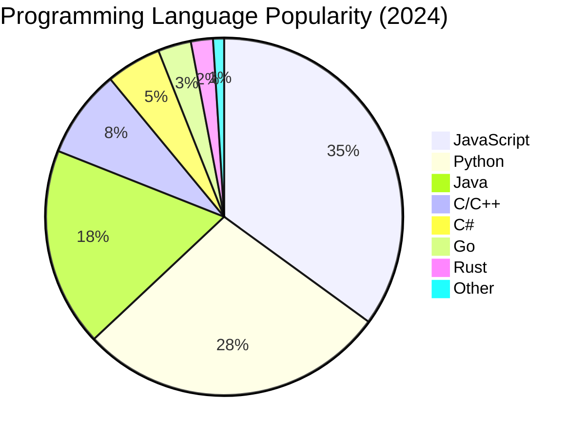

# Web App Architecture

## Architecture Diagram

```mermaid
flowchart TB
    subgraph Clients
        A[Browser]
        B[Mobile App]
        C[Desktop App]
    end

    subgraph Load Balancer
        D[Load Balancer]
    end

    subgraph Backend Services
        E[API Gateway]
        F[Auth Service]
        G[User Service]
        H[Product Service]
        I[Order Service]
    end

    subgraph Data Layer
        J[(Relational DB)]
        K[(NoSQL DB)]
        L[(Cache/Redis)]
        M[(File Storage)]
    end

    subgraph External Services
        N[Payment Gateway]
        O[Email Service]
        P[Analytics]
    end

    Clients --> Load Balancer
    Load Balancer --> API Gateway
    API Gateway --> Auth Service
    API Gateway --> User Service
    API Gateway --> Product Service
    API Gateway --> Order Service

    Auth Service --> J
    User Service --> J
    User Service --> L
    Product Service --> K
    Product Service --> L
    Order Service --> J
    Order Service --> K

    Order Service --> N
    Order Service --> O

    F --> J
    F --> L

    N -.-> P
    O -.-> P

    style Clients fill:#e1f5fe
    style Load Balancer fill:#fff3e0
    style Backend Services fill:#f3e5f5
    style Data Layer fill:#e8f5e9
    style External Services fill:#fce4ec
```

## Language Popularity Pie Chart



## Key Components

**Clients Layer:**
- Web browsers (Chrome, Firefox, Safari)
- Mobile applications (iOS, Android)
- Desktop applications

**Load Balancer:**
- Distributes traffic across backend services
- Provides high availability and scalability

**Backend Services:**
- API Gateway: Single entry point, routing, rate limiting
- Auth Service: Authentication, authorization, sessions
- User Service: User profiles, preferences
- Product Service: Product catalog, inventory
- Order Service: Order management, transactions

**Data Layer:**
- Relational DB: PostgreSQL, MySQL for structured data
- NoSQL DB: MongoDB, DynamoDB for flexible schemas
- Cache: Redis for session data and caching
- File Storage: S3, Azure Blob for media files

**External Services:**
- Payment: Stripe, PayPal
- Email: SendGrid, AWS SES
- Analytics: Google Analytics, Mixpanel